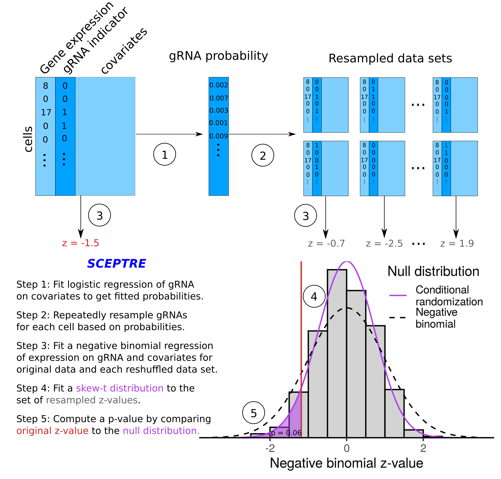

# SCEPTRE: Analysis of Single Cell Perturbation Screens via Conditional Resampling

SCEPTRE is a novel statistical methododology that infers gene-enhancer associations by modeling the stochastic assortment of CRISPR guide RNAs among cells instead of modeling gene expression, thereby remaining valid despite arbitrary misspecification of the gene expression model.

Accompanying paper:
> *Conditional resampling improves sensitivity and specificity of single cell CRISPR regulatory screens*  
> E. Katsevich and K. Roeder (2020) 
> preprint at bioRxiv; 

## Methodology overview

SCEPTRE proceeds one guide RNA (gRNA) and one gene at a time. It uses the $z$-value from a negative binomial regression to measure the effect of the gRNA on the gene. Instead of calibrating this $z$-value against a standard normal null distribution, we build a null distribution for this statistic via conditional resampling. To this end, we first fit a logistic regression model for the occurrence of the gRNA in a cell, based on its covariates. For each cell, this yields a fitted probability that it contains the gRNA. Then, we generate a large number (say 500) of reshuffled datasets, where the expression and the covariates stay the same, while the gRNA assignment is redrawn independently for each cell based on its fitted probability. The negative binomial $z$-value is then recomputed for each of these datasets, which comprise a null distribution. We fit a skew-$t$ distribution to these null histograms and compute the SCEPTRE $p$-value by comparing the original $z$-value to this fitted skew-$t$ null distribution. This scheme is an instance of the [conditional randomization test](https://rss.onlinelibrary.wiley.com/doi/abs/10.1111/rssb.12265).

## Using this repository

This repository provides code to reproduce all the data analysis in the above paper. 

## Dependencies

The code was run on Linux operating systems, using R version 3.6.3 with the following packages installed:
* R.utils 2.9.0
* reshape2 1.4.3
* MASS 7.3-51.4
* bigstatsr 0.9.1
* VGAM 1.1-1
* sn 1.5-4
* GenomicRanges 1.38.0
* plyranges 1.6.10
* ggrepel 0.8.1
* readxl 1.3.1
* scales 1.0.0
* kableExtra 1.1.0
* gridExtra 2.3
* tidyverse 1.2.1

